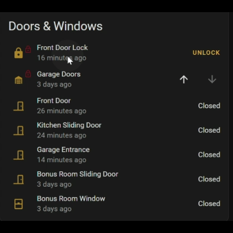

# August2MQTT
Ditch the August WiFi bridge, turn your Raspberry Pi into a BLE-capable MQTT Bridge talking directly to your lock, and own your lock!



This repo utilizes a heavily modified version of [Friendly0Fire/augustpy](https://github.com/Friendly0Fire/augustpy) and a moderately modified version of [adamf/BLE](https://github.com/adamf/BLE). The whole point of this project is to create a quick/lightweight MQTT bridge for August locks, without using the August WiFi bridge/August servers. With a local MQTT broker (like Mosquito), this project lets you create the ultimate local August lock integration for use with Home Assitant (ot any other smart home systems that can utilize MQTT). I run this on a Raspberry Pi Zero W that's within 20-30 ft of my lock.

# Umm, you must not have heard. Home Assistant now has a native BLE integration for August Locks. Why should I use this project?
With the native integration (hats off to the HA devs), I heard that it sometimes takes up to [15 seconds](https://github.com/esphome/issues/issues/3761#issuecomment-1333079982) for the locks to respond to commands from HA. The way the native HA integration works is that it connects to the lock only after you issue a command in HA. This adds a ton of latency, because every time you send a command, you have to wait for your host machine, or BLE proxies to scan for the lock, connect to the lock, go through the long authentication/handshake process, then finally send your command.

I wanted something much faster and light-weight. To achieve low latency and fast response, the magic sauce with this project is that the host machine is always connected via BLE to the lock.

# Wait what? Always connected? Are you out of your mind?
Yeah probably. But hear me out. That version of the blescan.py I modified allows me to set a BLE connection interval. Connection Interval is a concept in BLE that allows you to stay connected to a peripheral, and define how often the peripheral needs to wake up to maintain the connection. I am setting the connection interval long enough (1 second at the moment), and this is how I am minimizing the battery impact. Whether you are connected to the lock or not, the lock is already waking up every 300ms to send a BLE advertisement packet, so the active connection is just a drop in the bucket. In my testing, I am getting months of battery life out of my lock, just like before.

__The main benefit here is latency__. When you send the command to unlock over MQTT, the lock should receive this command within a second (that's where that 1 second connection interval comes in). And when you manually lock/unlock the door, again, an MQTT message will appear within a second. The native connection is especially slow in this scenario of capturing manual lock state changes, since it has to periodically connect and poll the lock. This project establishes near instant state updates by utilizing BLE notifications, which is only possible because we maintain an active connection with the lock. The slowest part of this whole thing right now is the Home Assistant/MQTT layer - but still much quicker than the native HA BLE integration for August Locks.

Update 3/8/23: Batteries lasted 6 months. No issue with drain at all.


# So how do I start using this?
This code is *rough*. It works, but it ain't pretty. You will notice a ton of commented out lines, and maybe even comments from me/previous devs. But once you get it up and running, it will get the job done! 

So here is how you start:
1. Clone the repo, and start by modifying `config.json` file with the info for your lock. Follow the instructions [here](https://github.com/Friendly0Fire/augustpy#putting-it-all-together) on how to create your lock config file. 

```
{"bluetoothAddress": "0A:1B:2C:3D:4E:5F", "handshakeKey": "ABCDEF0123456789ABCDEF0123456789", "handshakeKeyIndex": 1}
```
2. run setup.sh, which will download the required python libraries.
3. Go into `mqtt_august_bridge.py` and enter your MQTT server details. [Start here](https://github.com/aeozyalcin/August2MQTT/blob/7c642023cf61f34ea4f855b16ca4c509ae64ce11/mqtt_august_bridge.py#L65). <== *TODO: This will eventually go into `config.json` that you configured in step 1.*

```
broker_address="192.168.0.192" # <== this is where your MQTT server IP goes. No need for the port.
client = mqtt.Client("august_rpi") # <== this is just the name of the MQTT client. I called mine "august_rpi"
client.username_pw_set("august", "lock") # <== use this if your MQTT server requires authentication. If not, you can comment out this whole line.
client.connect(broker_address)
```
4. Just run `python3 mqtt_august_bridge.py`. *You will probably need to run it as sudo, since the we need access to the BLE hardware on your host.* 

Things to know:
- The bridge will listen for MQTT topic `august/lock/set` to wait for lock/unlock commands.
- The bridge will publish to MQTT topic `august/lock/state`, when the lock reports a state change.
- The bridge will publish to MQTT topic `august/lock/voltage`, when it gets a lock battery voltage update.

# FAQ
**Which locks does this code work with?**

I use this with an August Gen3 Pro lock. This should in theory work with all August BLE locks, and even some Yale locks (I believe Yale has acquired August). If t works or doesn't work for you, create an issue and let me know!

**What hardware should I run it on?**

If you are/plan on using the Home Assistant Bluetooth integration, I don't recommend running this on the same machine you are running Home Assistant on. Because doing so will prevent HA from being able to access the local Bluetooth adapter. If you don't care about using the Bluetooth integration in HA, then you should be OK to use this on the same machine as your HA. I run it on a Raspberry Pi Zero W, and it's perfect for the job. You can in theory use any linux machine with any Bluetooth adapter supported by Bluez.

**I am getting an error `ValueError: non-hexadecimal number found in fromhex() arg at position 0` when I try to run `mqtt_august_bridge.py`. What's up with that?**

Did you create your own `config.json` for your lock? You will get that error if you are using the default example `config.json` that came with the repo. Otherwise, you might have a typo in your `config.json`. 

**I am getting an error `_bluetooth.error: (1, 'Operation not permitted')`. What's up with that?**

That usually means that you are not running `mqtt_august_bridge.py` as root. You need to run it as root user, because we need to access the bluetooth adapter. Try running it as `sudo python3 mqtt_august_bridge.py` instead.

# I want to contribute!
Awesome! This is my first repo on GitHub, so I welcome other people's contributions! The way I have things together, it's meant for more advanced people, and cleaning up the code and documentation would definitely make it easier for less experienced people. I hope we get there one day. So feel free to create issues/make suggestions.
